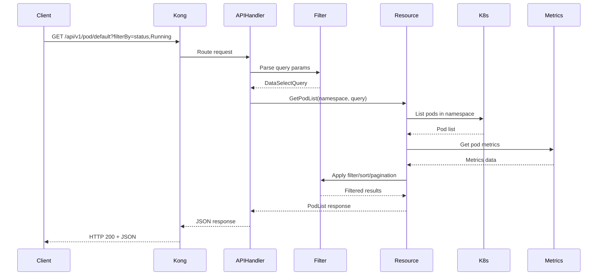

## Overview

The API module is a stateless Go application that serves as a Kubernetes API extension. It provides enhanced functionality on top of the standard Kubernetes API, including data aggregation, filtering, sorting, and pagination.

<Info>
The API module is the core backend service that powers most Dashboard features.
</Info>

## Module Architecture

### Entry Point

The module starts in `modules/api/main.go`:

```go
func main() {
    klog.InfoS("Starting Kubernetes Dashboard API", "version", environment.Version)
    
    // Initialize Kubernetes client
    client.Init(
        client.WithUserAgent(environment.UserAgent()),
        client.WithKubeconfig(args.KubeconfigPath()),
        client.WithMasterUrl(args.ApiServerHost()),
        client.WithInsecureTLSSkipVerify(args.ApiServerSkipTLSVerify()),
        client.WithCaBundle(args.ApiServerCaBundle()),
    )
    
    // Initialize integrations (metrics)
    integrationManager := integration.NewIntegrationManager()
    configureMetricsProvider(integrationManager)
    
    // Create HTTP API handler
    apiHandler, err := handler.CreateHTTPAPIHandler(integrationManager)
    
    // Serve HTTPS or HTTP
    if certs != nil {
        serveTLS(certs)
    } else {
        serve()
    }
}
```

**Reference**: `modules/api/main.go:39-93`

### Package Structure

```
modules/api/pkg/
├── args/              # Command-line argument parsing
├── environment/       # Version and build information
├── handler/           # HTTP request handlers and routing
│   ├── apihandler.go # Main API handler with all routes
│   ├── filter.go     # Request filtering logic
│   ├── metrics.go    # Metrics endpoint handlers
│   ├── terminal.go   # WebSocket terminal handlers
│   └── parser/       # Request parameter parsing
├── integration/       # Integration manager for external services
│   ├── manager.go    # Integration lifecycle management
│   ├── metric/       # Metrics integration
│   └── api/          # Integration API types
├── resource/          # Kubernetes resource handlers (38 packages)
│   ├── pod/
│   ├── deployment/
│   ├── service/
│   └── ...
├── scaling/           # Resource scaling operations
└── validation/        # Input validation
```

## Core Responsibilities

### 1. Resource Aggregation

The API module aggregates related data from multiple Kubernetes resources:

<CodeGroup>
```go Pod Detail with Events & Metrics
// Returns pod details with associated events and metrics
func GetPodDetail(client kubernetes.Interface, 
                  namespace, name string) (*PodDetail, error) {
    
    // Get pod
    pod := getPod(client, namespace, name)
    
    // Get events for pod
    events := getEvents(client, namespace, pod.UID)
    
    // Get metrics from integration
    metrics := getMetrics(namespace, name)
    
    return &PodDetail{
        Pod:     pod,
        Events:  events,
        Metrics: metrics,
    }
}
```

```go Deployment with ReplicaSets
// Returns deployment with old and new replica sets
func GetDeploymentDetail(client kubernetes.Interface,
                        namespace, name string) (*DeploymentDetail, error) {
    
    deployment := getDeployment(client, namespace, name)
    oldRS := getOldReplicaSets(client, deployment)
    newRS := getNewReplicaSet(client, deployment)
    
    return &DeploymentDetail{
        Deployment:      deployment,
        OldReplicaSets: oldRS,
        NewReplicaSet:  newRS,
    }
}
```
</CodeGroup>

### 2. Filtering and Sorting

Implements server-side data selection through the `dataselect` package:

```go
// Query parameters supported
type DataSelectQuery struct {
    FilterQuery   *FilterQuery   // filterBy=propertyName,filterValue
    SortQuery     *SortQuery     // sortBy=columnName
    PaginationQuery *PaginationQuery // page=1&itemsPerPage=10
}
```

**Example Usage**:
```
GET /api/v1/pod?filterBy=status,Running&sortBy=creationTimestamp&page=1&itemsPerPage=25
```

### 3. Pagination

Reduces response payload size for large clusters:

```go
type PaginationQuery struct {
    ItemsPerPage int // Number of items per page
    Page         int // Current page number
}

type ListMeta struct {
    TotalItems int // Total number of items available
}
```

### 4. Terminal Access

Provides exec and shell access to containers via WebSocket:

```go
// Terminal session endpoint
GET /api/v1/pod/{namespace}/{pod}/shell/{container}

// Returns session ID for WebSocket connection
type TerminalResponse struct {
    ID string `json:"id"` // Session identifier
}
```

WebSocket endpoint: `/api/sockjs/`

**Reference**: `modules/api/pkg/handler/terminal.go`

## API Routes

The API module exposes comprehensive RESTful endpoints at `/api/v1/*`:

### Workload Resources

<AccordionGroup>
  <Accordion title="Pods">
    - `GET /api/v1/pod` - List all pods
    - `GET /api/v1/pod/{namespace}` - List pods in namespace
    - `GET /api/v1/pod/{namespace}/{pod}` - Get pod details
    - `GET /api/v1/pod/{namespace}/{pod}/event` - Get pod events
    - `GET /api/v1/pod/{namespace}/{pod}/shell/{container}` - Exec into container
  </Accordion>
  
  <Accordion title="Deployments">
    - `GET /api/v1/deployment` - List all deployments
    - `GET /api/v1/deployment/{namespace}/{deployment}` - Get deployment details
    - `PUT /api/v1/deployment/{namespace}/{deployment}/pause` - Pause deployment
    - `PUT /api/v1/deployment/{namespace}/{deployment}/resume` - Resume deployment
    - `PUT /api/v1/deployment/{namespace}/{deployment}/restart` - Restart deployment
    - `PUT /api/v1/deployment/{namespace}/{deployment}/rollback` - Rollback deployment
  </Accordion>
  
  <Accordion title="StatefulSets, DaemonSets, ReplicaSets">
    - `GET /api/v1/statefulset/{namespace}/{statefulset}`
    - `GET /api/v1/daemonset/{namespace}/{daemonset}`
    - `GET /api/v1/replicaset/{namespace}/{replicaset}`
    - Similar patterns for events, pods, services
  </Accordion>
</AccordionGroup>

### Configuration and Storage

- ConfigMaps: `/api/v1/configmap/*`
- Secrets: `/api/v1/secret/*`
- PersistentVolumes: `/api/v1/persistentvolume/*`
- PersistentVolumeClaims: `/api/v1/persistentvolumeclaim/*`
- StorageClasses: `/api/v1/storageclass/*`

### Cluster Resources

- Nodes: `/api/v1/node/*`
- Namespaces: `/api/v1/namespace/*`
- Events: `/api/v1/event/*`

### RBAC

- ClusterRoles: `/api/v1/clusterrole/*`
- ClusterRoleBindings: `/api/v1/clusterrolebinding/*`
- Roles: `/api/v1/role/*`
- RoleBindings: `/api/v1/rolebinding/*`
- ServiceAccounts: `/api/v1/serviceaccount/*`

**Reference**: `modules/api/pkg/handler/apihandler.go:95-1200`

## Integration Manager

The Integration Manager handles communication with external services:

### Metrics Integration

```go
type Manager interface {
    GetState(id api.IntegrationID) (*api.IntegrationState, error)
    Metric() metric.MetricManager
}

// Configure sidecar metrics provider
func configureMetricsProvider(integrationManager integration.Manager) {
    switch metricsProvider := args.MetricsProvider(); metricsProvider {
    case "sidecar":
        integrationManager.Metric().ConfigureSidecar(args.SidecarHost()).
            EnableWithRetry(integrationapi.SidecarIntegrationID, 
                          time.Duration(args.MetricClientHealthCheckPeriod()))
    case "none":
        klog.Info("Metrics provider disabled")
    }
}
```

**Reference**: 
- `modules/api/pkg/integration/manager.go`
- `modules/api/main.go:122-135`

### Integration Health Checks

```go
type IntegrationState struct {
    Connected   bool      // Connection status
    Error       error     // Last error if any
    LastChecked time.Time // Last health check time
}
```

## Request Handling Flow



## OpenAPI Documentation

When enabled, the API module generates OpenAPI/Swagger documentation:

```go
if args.IsOpenAPIEnabled() {
    klog.Info("Enabling OpenAPI endpoint on /apidocs.json")
    configureOpenAPI(apiHandler)
}

func enrichOpenAPIObject(swo *spec.Swagger) {
    swo.Info = &spec.Info{
        InfoProps: spec.InfoProps{
            Title:   "Kubernetes Dashboard API",
            Version: environment.Version,
        },
    }
}
```

Access at: `GET /apidocs.json`

**Reference**: `modules/api/main.go:70-153`

## Resource Scaling

Generic scaling endpoints support any scalable resource:

```go
// Scale resource to specific replica count
PUT /api/v1/scale/{kind}/{namespace}/{name}?scaleBy=5

// Get current replica count
GET /api/v1/scale/{kind}/{namespace}/{name}

type ReplicaCounts struct {
    DesiredReplicas int32
    ActualReplicas  int32
}
```

Supports: Deployments, ReplicaSets, StatefulSets, ReplicationControllers

**Reference**: `modules/api/pkg/scaling/`

## CSRF Protection

```go
// Generate CSRF token for action
GET /api/v1/csrftoken/{action}

type Response struct {
    Token string `json:"token"`
}
```

CSRF tokens must be included in headers for:
- POST requests (create resources)
- PUT requests (update resources)
- DELETE requests (delete resources)

## Configuration Arguments

Key command-line arguments (via `pkg/args`):

| Argument | Description | Default |
|----------|-------------|---------|
| `--kubeconfig` | Path to kubeconfig file | In-cluster config |
| `--apiserver-host` | Kubernetes API server URL | Auto-detected |
| `--insecure-bind-address` | HTTP bind address | `0.0.0.0:9090` |
| `--bind-address` | HTTPS bind address | `0.0.0.0:8443` |
| `--metrics-provider` | Metrics provider (sidecar/none) | `sidecar` |
| `--sidecar-host` | Metrics scraper URL | `http://localhost:8000` |
| `--enable-openapi` | Enable OpenAPI endpoint | `false` |

## Prometheus Metrics

The API module exposes Prometheus metrics:

```go
http.Handle("/metrics", promhttp.Handler())
```

Endpoint: `GET /metrics`

Metrics include:
- Request count and latency
- Go runtime metrics
- Custom business metrics

## Error Handling

Consistent error responses across all endpoints:

```json
{
  "status": "error",
  "code": 404,
  "message": "Pod not found",
  "errors": []
}
```

**Reference**: `modules/common/errors/`

## Testing

The API module includes comprehensive tests:

```bash
# Run API module tests
cd modules/api
go test ./...

# Run with coverage
go test -cover ./...
```

## Proxy Mode

The API module can run in proxy mode for development:

```bash
--proxy-enabled=true
```

In proxy mode:
- No in-cluster client connections
- Metrics integration disabled
- Useful for frontend development without K8s cluster

**Reference**: `modules/api/main.go:50-63`

## Deployment

Helm chart deployment configuration:

```yaml
api:
  image:
    repository: kubernetesui/dashboard-api
    tag: v1.0.0
  containers:
    args:
      - --metrics-provider=sidecar
      - --sidecar-host=http://kubernetes-dashboard-metrics-scraper:8000
  scaling:
    replicas: 1
```

**Reference**: `charts/kubernetes-dashboard/templates/deployments/api.yaml`

## Related Resources

<CardGroup cols={2}>
  <Card title="Integration Manager" icon="plug" href="/architecture/api-module#integration-manager">
    Learn about service integrations
  </Card>
  
  <Card title="Metrics Scraper" icon="chart-line" href="/architecture/metrics-scraper">
    How metrics are collected and served
  </Card>
  
  <Card title="Auth Module" icon="lock" href="/architecture/auth-module">
    Authentication and CSRF protection
  </Card>
  
  <Card title="Resource Handlers" icon="code">
    Source: `modules/api/pkg/resource/`
  </Card>
</CardGroup>
