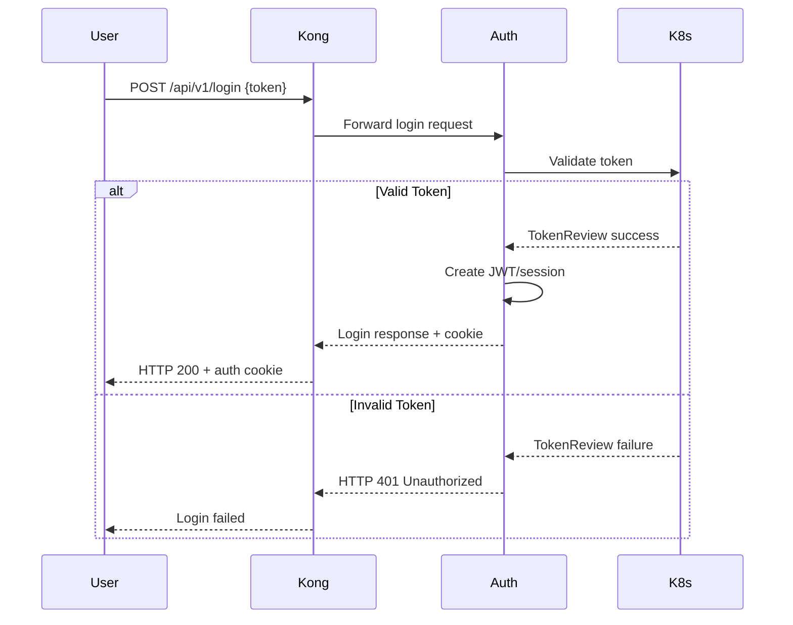
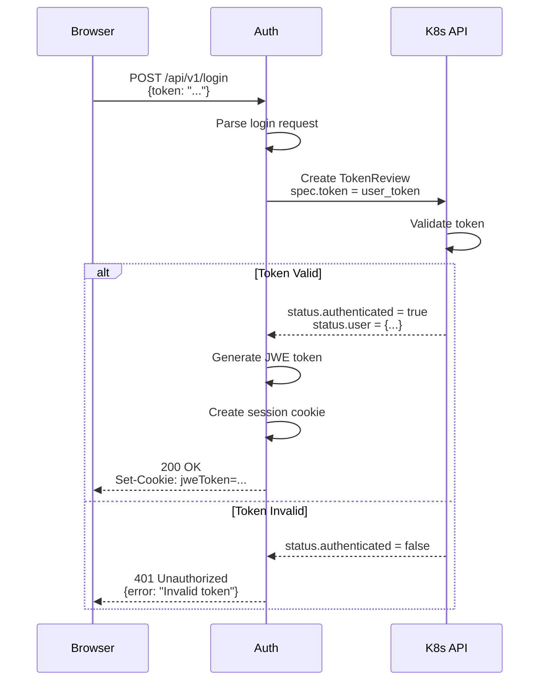

## Overview

The Auth module is a lightweight Go application responsible for handling authentication to the Kubernetes API. It provides secure login endpoints and manages user sessions through token validation.

<Info>
The Auth module acts as an authentication gateway, validating credentials before granting access to Dashboard features.
</Info>

## Module Architecture

### Entry Point

The module starts in `modules/auth/main.go`:

```go
func main() {
    klog.InfoS("Starting Kubernetes Dashboard Auth", "version", environment.Version)
    
    // Initialize Kubernetes client
    client.Init(
        client.WithUserAgent(environment.UserAgent()),
        client.WithKubeconfig(args.KubeconfigPath()),
        client.WithMasterUrl(args.ApiServerHost()),
        client.WithInsecureTLSSkipVerify(args.ApiServerSkipTLSVerify()),
        client.WithCaBundle(args.ApiServerCaBundle()),
    )
    
    // Start Gin router
    klog.V(1).InfoS("Listening and serving insecurely on", "address", args.Address())
    if err := router.Router().Run(args.Address()); err != nil {
        klog.ErrorS(err, "Router error")
        os.Exit(1)
    }
}
```

**Reference**: `modules/auth/main.go:33-49`

### Package Structure

```
modules/auth/
├── api/
│   └── v1/
│       └── login.go        # Login API types
├── pkg/
│   ├── args/              # Command-line arguments
│   ├── environment/       # Version information
│   ├── router/            # Gin router setup
│   └── routes/            # Route handlers
│       ├── csrftoken/     # CSRF token generation
│       ├── login/         # Login handler
│       └── me/            # User info endpoint
└── main.go
```

## Core Responsibilities

### 1. User Authentication

The Auth module validates user credentials against the Kubernetes API Server.

#### Login Request Flow



### 2. CSRF Token Generation

Provides CSRF tokens for state-changing operations:

```go
// GET /api/v1/csrftoken/{action}
// Returns a one-time CSRF token

type CsrfTokenResponse struct {
    Token string `json:"token"`
}
```

**Reference**: `modules/auth/pkg/routes/csrftoken/handler.go`

### 3. User Information

Returns authenticated user details:

```go
// GET /api/v1/me
// Returns current user information

type UserResponse struct {
    Username  string   `json:"username"`
    Groups    []string `json:"groups"`
    Namespace string   `json:"namespace"`
}
```

**Reference**: `modules/auth/pkg/routes/me/handler.go`

## Authentication Methods

The Auth module supports multiple authentication strategies:

### Token-Based Authentication

Users provide a Kubernetes service account token or user token:

```json
{
  "token": "eyJhbGciOiJSUzI1NiIsImtpZCI6Ii...",
  "namespace": "default"
}
```

#### Token Validation Process

1. **Receive token** from login request
2. **Create TokenReview** request to Kubernetes API
3. **Validate response** from TokenReview API
4. **Extract user info** (username, UID, groups)
5. **Generate session** token or cookie
6. **Return authentication** response

### Kubeconfig-Based Authentication

Users can upload kubeconfig files containing:

- Client certificates
- Bearer tokens
- Username/password credentials

<Warning>
Kubeconfig authentication should only be used in trusted environments. Tokens are preferred for production.
</Warning>

## API Routes

The Auth module exposes three primary endpoints:

### POST /api/v1/login

Authenticates a user and returns session information.

**Request**:
```json
{
  "token": "string",
  "namespace": "string"
}
```

**Response**:
```json
{
  "jweToken": "string",
  "errors": []
}
```

**Reference**: `modules/auth/pkg/routes/login/handler.go:27-48`

### GET /api/v1/csrftoken/{action}

Generates a CSRF token for the specified action.

**Parameters**:
- `action` (path): Action name (e.g., "deploy", "scale")

**Response**:
```json
{
  "token": "string"
}
```

### GET /api/v1/me

Returns information about the currently authenticated user.

**Response**:
```json
{
  "username": "system:serviceaccount:default:dashboard",
  "groups": [
    "system:serviceaccounts",
    "system:authenticated"
  ]
}
```

## Security Features

### CSRF Protection

The Auth module generates CSRF tokens using a shared secret:

```go
import "golang.org/x/net/xsrftoken"

func generateToken(action, userID string) string {
    return xsrftoken.Generate(
        csrfKey,      // Shared secret with API module
        userID,       // User identifier
        action,       // Action being protected
    )
}
```

The CSRF key is:
- Shared between Auth and API modules via Kubernetes Secret
- Base64-encoded 256-byte random string
- Auto-generated if not provided in Helm values

### Session Management

Authentication sessions are managed through:

1. **JWE Tokens**: Encrypted JSON Web Tokens
2. **HTTP-only Cookies**: Secure session cookies
3. **Token Refresh**: Automatic token refresh mechanism

### TLS/HTTPS

The Auth module supports both HTTP and HTTPS:

```go
// HTTP mode (behind Kong gateway)
router.Router().Run(args.Address())

// HTTPS mode (direct access)
router.Router().RunTLS(args.Address(), certPath, keyPath)
```

In typical deployments, the Auth module runs HTTP behind Kong Gateway, which handles TLS termination.

## Request Flow

### Login Flow



### Token Review API

The Auth module uses Kubernetes TokenReview API:

```yaml
apiVersion: authentication.k8s.io/v1
kind: TokenReview
spec:
  token: "<user-provided-token>"
status:
  authenticated: true
  user:
    username: "system:serviceaccount:default:dashboard"
    uid: "abc123"
    groups:
    - "system:serviceaccounts"
    - "system:authenticated"
```

## Configuration Arguments

Key command-line arguments:

| Argument | Description | Default |
|----------|-------------|---------|
| `--kubeconfig` | Path to kubeconfig file | In-cluster config |
| `--apiserver-host` | Kubernetes API server URL | Auto-detected |
| `--bind-address` | Bind address | `0.0.0.0:8000` |
| `--csrf-key` | CSRF token secret key | Auto-generated |
| `--token-ttl` | Session token TTL | `15m` |

**Reference**: `modules/auth/pkg/args/args.go`

## Router Setup

The Auth module uses Gin web framework:

```go
func Router() *gin.Engine {
    router := gin.New()
    
    // Middleware
    router.Use(gin.Logger())
    router.Use(gin.Recovery())
    
    // CORS headers
    router.Use(corsMiddleware())
    
    // API v1 routes
    v1 := router.Group("/api/v1")
    
    return router
}
```

**Reference**: `modules/auth/pkg/router/setup.go`

### Route Registration

Routes are registered via init() functions:

```go
// modules/auth/main.go
import (
    _ "k8s.io/dashboard/auth/pkg/routes/csrftoken"
    _ "k8s.io/dashboard/auth/pkg/routes/login"
    _ "k8s.io/dashboard/auth/pkg/routes/me"
)

// modules/auth/pkg/routes/login/handler.go
func init() {
    router.V1().POST("/login", handleLogin)
}
```

**Reference**: `modules/auth/main.go:27-31`

## Error Handling

Consistent error responses:

```json
{
  "errors": [
    "Invalid authentication token"
  ]
}
```

HTTP status codes:
- `200 OK` - Successful authentication
- `400 Bad Request` - Malformed request
- `401 Unauthorized` - Invalid credentials
- `500 Internal Server Error` - Server error

## Integration with Other Modules

### With API Module

The API module validates CSRF tokens generated by Auth module:

```go
// API module validates token
if !xsrftoken.Valid(token, csrfKey, userID, action) {
    return errors.New("invalid CSRF token")
}
```

### With Kong Gateway

Kong routes authentication requests to Auth module:

```yaml
routes:
  - name: auth-login
    paths:
      - /api/v1/login
    service: kubernetes-dashboard-auth
```

## Deployment

Helm chart configuration:

```yaml
auth:
  image:
    repository: kubernetesui/dashboard-auth
    tag: v1.0.0
  scaling:
    replicas: 1
  containers:
    args: []
    env:
      - name: CSRF_KEY
        valueFrom:
          secretKeyRef:
            name: kubernetes-dashboard-csrf
            key: csrf
```

**Reference**: `charts/kubernetes-dashboard/templates/deployments/auth.yaml`

## Testing

Run Auth module tests:

```bash
cd modules/auth
go test ./...
```

### Manual Testing

```bash
# Get service account token
TOKEN=$(kubectl get secret <secret-name> -o jsonpath='{.data.token}' | base64 -d)

# Test login endpoint
curl -X POST http://localhost:8000/api/v1/login \
  -H "Content-Type: application/json" \
  -d '{"token": "'$TOKEN'"}'

# Test CSRF endpoint
curl http://localhost:8000/api/v1/csrftoken/deploy
```

## Logging

The Auth module uses structured logging:

```go
import "k8s.io/klog/v2"

klog.InfoS("Starting Kubernetes Dashboard Auth", "version", environment.Version)
klog.ErrorS(err, "Could not log in")
klog.V(1).InfoS("Listening and serving on", "address", args.Address())
```

Log levels:
- `0` - Info and errors
- `1` - Verbose info
- `2+` - Debug information

## Security Best Practices

<AccordionGroup>
  <Accordion title="Token Storage">
    - Never log authentication tokens
    - Clear tokens from memory after use
    - Use secure session storage
  </Accordion>
  
  <Accordion title="CSRF Protection">
    - Rotate CSRF keys regularly
    - Use different tokens for different actions
    - Validate token expiration
  </Accordion>
  
  <Accordion title="TLS Configuration">
    - Always use HTTPS in production
    - Use strong cipher suites
    - Enable certificate validation
  </Accordion>
  
  <Accordion title="Rate Limiting">
    - Implement login attempt limiting
    - Block suspicious IP addresses
    - Monitor failed authentication attempts
  </Accordion>
</AccordionGroup>

## Troubleshooting

### Common Issues

<AccordionGroup>
  <Accordion title="401 Unauthorized">
    **Cause**: Invalid or expired token
    
    **Solution**:
    - Verify token is valid: `kubectl get secret`
    - Check token hasn't expired
    - Ensure service account exists
  </Accordion>
  
  <Accordion title="CSRF Token Mismatch">
    **Cause**: Auth and API modules using different CSRF keys
    
    **Solution**:
    - Check `kubernetes-dashboard-csrf` secret
    - Restart both Auth and API pods
    - Verify secret is mounted correctly
  </Accordion>
  
  <Accordion title="Cannot Connect to Kubernetes API">
    **Cause**: Invalid API server configuration
    
    **Solution**:
    - Check `--apiserver-host` argument
    - Verify RBAC permissions
    - Check network connectivity
  </Accordion>
</AccordionGroup>

## Related Resources

<CardGroup cols={2}>
  <Card title="API Module" icon="server" href="/architecture/api-module">
    How API module validates CSRF tokens
  </Card>
  
  <Card title="Security" icon="shield">
    Dashboard security documentation
  </Card>
  
  <Card title="RBAC Configuration" icon="lock">
    Setting up proper permissions
  </Card>
  
  <Card title="Kubernetes TokenReview" icon="link" href="https://kubernetes.io/docs/reference/kubernetes-api/authentication-resources/token-review-v1/">
    Kubernetes TokenReview API documentation
  </Card>
</CardGroup>
