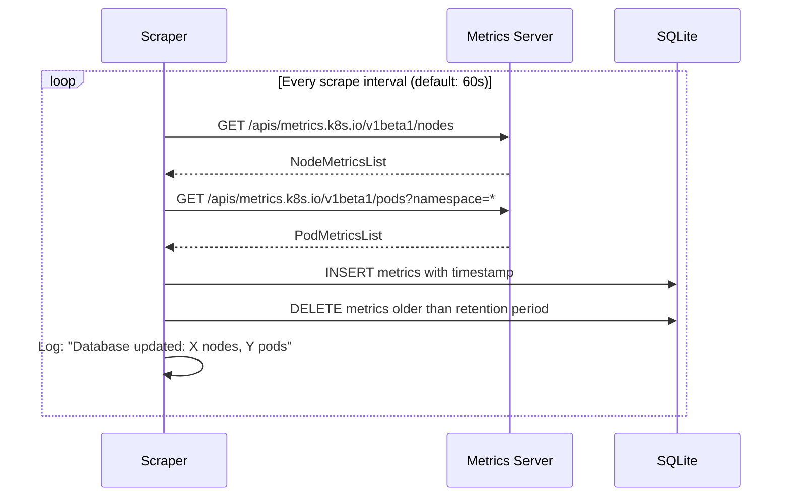
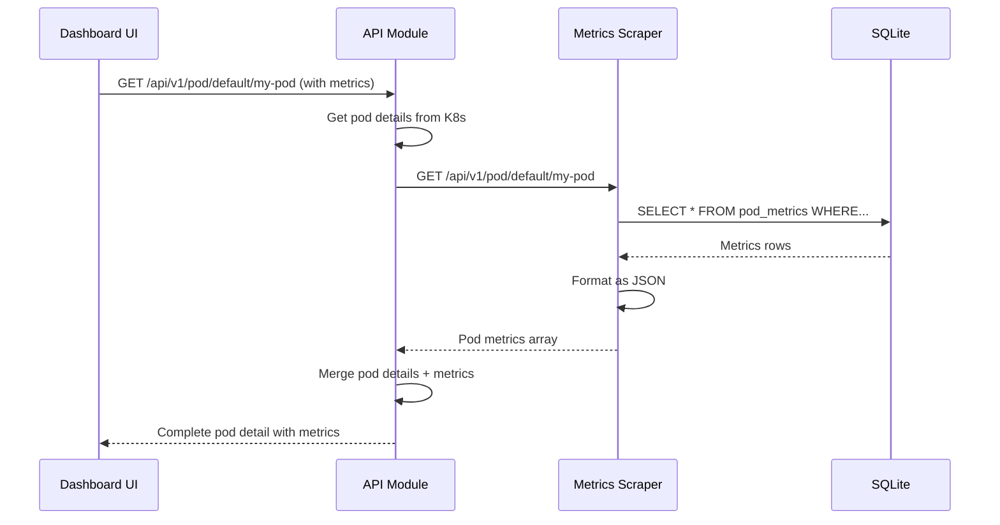

## Overview

The Metrics Scraper is a specialized Go module that continuously scrapes metrics from the Kubernetes Metrics Server and stores them in a local SQLite database. It provides the API module with historical metrics data for visualizing resource usage over time.

<Info>
The Metrics Scraper is optional but recommended for viewing CPU and memory usage trends in the Dashboard.
</Info>

## Module Architecture

### Design Philosophy

The Metrics Scraper operates independently from other Dashboard modules:

- **Autonomous**: Runs its own scraping loop
- **Lightweight**: Stores only a small time window of metrics
- **Stateful**: Maintains state in SQLite database
- **Simple API**: Exposes HTTP endpoints for metrics queries

### Entry Point

The module starts in `modules/metrics-scraper/main.go`:

```go
func main() {
    klog.InfoS("Starting Metrics Scraper", "version", environment.Version)
    
    // Build Kubernetes config
    config, err := clientcmd.BuildConfigFromFlags("", args.KubeconfigPath())
    if err != nil {
        klog.Fatalf("Unable to generate a client config: %s", err)
    }
    
    // Create metrics client
    clientset, err := metricsclient.NewForConfig(config)
    if err != nil {
        klog.Fatalf("Unable to generate a clientset: %s", err)
    }
    
    // Open SQLite database
    db, err := sql.Open("sqlite", args.DBFile())
    if err != nil {
        klog.Fatalf("Unable to open Sqlite database: %s", err)
    }
    defer db.Close()
    
    // Create database tables
    err = database.CreateDatabase(db)
    if err != nil {
        klog.Fatalf("Unable to initialize database tables: %s", err)
    }
    
    // Start HTTP API server
    go func() {
        r := mux.NewRouter()
        api.Manager(r, db)
        klog.Fatal(http.ListenAndServe(":8000", handlers.CombinedLoggingHandler(os.Stdout, r)))
    }()
    
    // Start scraping loop
    ticker := time.NewTicker(args.MetricResolution())
    for {
        select {
        case <-ticker.C:
            err = update(clientset, db, args.MetricDuration(), args.MetricNamespaces())
            if err != nil {
                break
            }
        }
    }
}
```

**Reference**: `modules/metrics-scraper/main.go:42-98`

### Package Structure

```
modules/metrics-scraper/pkg/
├── api/                    # HTTP API handlers
│   ├── api.go             # Router setup
│   └── dashboard/         # Dashboard metrics endpoints
│       ├── dashboard.go   # Handler implementation
│       └── types.go       # Response types
├── args/                  # Command-line arguments
├── database/              # SQLite database operations
│   ├── database.go        # CRUD operations
│   └── database_test.go   # Database tests
└── environment/           # Version information
```

## Scraping Architecture

### Metrics Collection Flow



### Update Function

Core scraping logic:

```go
func update(client *metricsclient.Clientset, db *sql.DB, 
           metricDuration time.Duration, metricNamespaces []string) error {
    
    nodeMetrics := &v1beta1.NodeMetricsList{}
    podMetrics := &v1beta1.PodMetricsList{}
    ctx := context.TODO()
    
    // Scrape node metrics if no namespace filter
    if len(metricNamespaces) == 1 && metricNamespaces[0] == "" {
        nodeMetrics, err = client.MetricsV1beta1().NodeMetricses().List(ctx, v1.ListOptions{})
        if err != nil {
            klog.Errorf("Error scraping node metrics: %s", err)
            return err
        }
    }
    
    // Scrape pod metrics for each namespace
    for _, namespace := range metricNamespaces {
        pod, err := client.MetricsV1beta1().PodMetricses(namespace).List(ctx, v1.ListOptions{})
        if err != nil {
            klog.Errorf("Error scraping '%s' for pod metrics: %s", namespace, err)
            return err
        }
        podMetrics.Items = append(podMetrics.Items, pod.Items...)
    }
    
    // Insert metrics into database
    err = database.UpdateDatabase(db, nodeMetrics, podMetrics)
    if err != nil {
        klog.Errorf("Error updating database: %s", err)
        return err
    }
    
    // Remove old metrics
    err = database.CullDatabase(db, metricDuration)
    if err != nil {
        klog.Errorf("Error culling database: %s", err)
        return err
    }
    
    klog.Infof("Database updated: %d nodes, %d pods", 
              len(nodeMetrics.Items), len(podMetrics.Items))
    return nil
}
```

**Reference**: `modules/metrics-scraper/main.go:103-147`

## Database Schema

### SQLite Tables

The Metrics Scraper uses two main tables:

#### Node Metrics Table

```sql
CREATE TABLE node_metrics (
    timestamp INTEGER NOT NULL,
    node_name TEXT NOT NULL,
    cpu_usage INTEGER NOT NULL,     -- CPU in nanocores
    memory_usage INTEGER NOT NULL,  -- Memory in bytes
    PRIMARY KEY (timestamp, node_name)
);

CREATE INDEX idx_node_timestamp ON node_metrics(timestamp);
```

#### Pod Metrics Table

```sql
CREATE TABLE pod_metrics (
    timestamp INTEGER NOT NULL,
    namespace TEXT NOT NULL,
    pod_name TEXT NOT NULL,
    container_name TEXT NOT NULL,
    cpu_usage INTEGER NOT NULL,     -- CPU in nanocores
    memory_usage INTEGER NOT NULL,  -- Memory in bytes
    PRIMARY KEY (timestamp, namespace, pod_name, container_name)
);

CREATE INDEX idx_pod_timestamp ON pod_metrics(timestamp);
CREATE INDEX idx_pod_namespace ON pod_metrics(namespace, pod_name);
```

### Database Operations

<CodeGroup>
```go Create Tables
func CreateDatabase(db *sql.DB) error {
    createNodeTable := `
        CREATE TABLE IF NOT EXISTS node_metrics (
            timestamp INTEGER NOT NULL,
            node_name TEXT NOT NULL,
            cpu_usage INTEGER NOT NULL,
            memory_usage INTEGER NOT NULL,
            PRIMARY KEY (timestamp, node_name)
        )
    `
    
    createPodTable := `
        CREATE TABLE IF NOT EXISTS pod_metrics (
            timestamp INTEGER NOT NULL,
            namespace TEXT NOT NULL,
            pod_name TEXT NOT NULL,
            container_name TEXT NOT NULL,
            cpu_usage INTEGER NOT NULL,
            memory_usage INTEGER NOT NULL,
            PRIMARY KEY (timestamp, namespace, pod_name, container_name)
        )
    `
    
    _, err := db.Exec(createNodeTable)
    if err != nil {
        return err
    }
    
    _, err = db.Exec(createPodTable)
    return err
}
```

```go Insert Metrics
func UpdateDatabase(db *sql.DB, nodeMetrics *v1beta1.NodeMetricsList, 
                   podMetrics *v1beta1.PodMetricsList) error {
    
    timestamp := time.Now().Unix()
    
    // Insert node metrics
    for _, node := range nodeMetrics.Items {
        cpu := node.Usage.Cpu().MilliValue()  // Convert to millicores
        memory := node.Usage.Memory().Value()  // Bytes
        
        _, err := db.Exec(
            "INSERT INTO node_metrics (timestamp, node_name, cpu_usage, memory_usage) VALUES (?, ?, ?, ?)",
            timestamp, node.Name, cpu, memory,
        )
        if err != nil {
            return err
        }
    }
    
    // Insert pod metrics
    for _, pod := range podMetrics.Items {
        for _, container := range pod.Containers {
            cpu := container.Usage.Cpu().MilliValue()
            memory := container.Usage.Memory().Value()
            
            _, err := db.Exec(
                "INSERT INTO pod_metrics (timestamp, namespace, pod_name, container_name, cpu_usage, memory_usage) VALUES (?, ?, ?, ?, ?, ?)",
                timestamp, pod.Namespace, pod.Name, container.Name, cpu, memory,
            )
            if err != nil {
                return err
            }
        }
    }
    
    return nil
}
```

```go Cull Old Data
func CullDatabase(db *sql.DB, duration time.Duration) error {
    cutoff := time.Now().Add(-duration).Unix()
    
    _, err := db.Exec("DELETE FROM node_metrics WHERE timestamp < ?", cutoff)
    if err != nil {
        return err
    }
    
    _, err = db.Exec("DELETE FROM pod_metrics WHERE timestamp < ?", cutoff)
    return err
}
```
</CodeGroup>

**Reference**: `modules/metrics-scraper/pkg/database/database.go`

## HTTP API

### Endpoints

The Metrics Scraper exposes a simple REST API:

#### GET /api/v1/node

Returns metrics for all nodes:

```json
{
  "nodes": [
    {
      "name": "node-1",
      "metrics": [
        {
          "timestamp": 1234567890,
          "cpu": 250,        // millicores
          "memory": 2048000000  // bytes
        }
      ]
    }
  ]
}
```

#### GET /api/v1/node/{node}

Returns metrics for a specific node.

#### GET /api/v1/pod/{namespace}

Returns metrics for all pods in a namespace:

```json
{
  "pods": [
    {
      "namespace": "default",
      "name": "my-pod",
      "containers": [
        {
          "name": "app",
          "metrics": [
            {
              "timestamp": 1234567890,
              "cpu": 100,
              "memory": 536870912
            }
          ]
        }
      ]
    }
  ]
}
```

#### GET /api/v1/pod/{namespace}/{pod}

Returns metrics for a specific pod.

#### GET /api/v1/pod/{namespace}/{pod}/{container}

Returns metrics for a specific container.

**Reference**: `modules/metrics-scraper/pkg/api/dashboard/dashboard.go`

### API Router Setup

```go
func Manager(r *mux.Router, db *sql.DB) {
    handler := &dashboardHandler{db: db}
    
    r.HandleFunc("/api/v1/node", handler.nodeList).Methods("GET")
    r.HandleFunc("/api/v1/node/{node}", handler.nodeDetail).Methods("GET")
    
    r.HandleFunc("/api/v1/pod/{namespace}", handler.podList).Methods("GET")
    r.HandleFunc("/api/v1/pod/{namespace}/{pod}", handler.podDetail).Methods("GET")
    r.HandleFunc("/api/v1/pod/{namespace}/{pod}/{container}", handler.containerDetail).Methods("GET")
}
```

**Reference**: `modules/metrics-scraper/pkg/api/api.go`

## Configuration

### Command-Line Arguments

| Argument | Description | Default |
|----------|-------------|---------|
| `--kubeconfig` | Path to kubeconfig file | In-cluster config |
| `--db-file` | Path to SQLite database | `/tmp/metrics.db` |
| `--metric-resolution` | Scrape interval | `60s` |
| `--metric-duration` | Retention period | `15m` |
| `--namespace` | Namespaces to scrape (comma-separated) | All namespaces |

**Reference**: `modules/metrics-scraper/pkg/args/args.go`

### Examples

```bash
# Scrape every 30 seconds, keep 30 minutes of data
metrics-scraper --metric-resolution=30s --metric-duration=30m

# Scrape only specific namespaces
metrics-scraper --namespace=default,kube-system

# Use custom database location
metrics-scraper --db-file=/data/metrics.db
```

## Integration with API Module

The API module queries the Metrics Scraper via HTTP:

```go
// API module configures sidecar integration
integrationManager.Metric().ConfigureSidecar(args.SidecarHost()).
    EnableWithRetry(integrationapi.SidecarIntegrationID, 
                   time.Duration(args.MetricClientHealthCheckPeriod()))

// Default sidecar host
sidecarHost := "http://kubernetes-dashboard-metrics-scraper:8000"
```

### Request Flow



**Reference**: `modules/api/main.go:122-135`

## Performance Considerations

### Storage Efficiency

<AccordionGroup>
  <Accordion title="Limited Time Window">
    Only stores recent metrics (default 15 minutes):
    
    ```go
    // Automatic cleanup every scrape interval
    database.CullDatabase(db, args.MetricDuration())
    ```
    
    Typical database size: 1-10 MB depending on cluster size
  </Accordion>
  
  <Accordion title="Indexed Queries">
    Database indexes optimize common queries:
    
    ```sql
    CREATE INDEX idx_pod_namespace ON pod_metrics(namespace, pod_name);
    CREATE INDEX idx_pod_timestamp ON pod_metrics(timestamp);
    ```
  </Accordion>
  
  <Accordion title="In-Memory Database Option">
    For ephemeral storage:
    
    ```bash
    --db-file=:memory:
    ```
  </Accordion>
</AccordionGroup>

### Scraping Efficiency

- **Namespace Filtering**: Only scrape required namespaces
- **Batched Inserts**: All metrics inserted in single transaction
- **Error Resilience**: Failed scrapes don't stop the loop

## Deployment

### Helm Chart Configuration

```yaml
metricsScraper:
  enabled: true
  image:
    repository: kubernetesui/metrics-scraper
    tag: v1.0.0
  scaling:
    replicas: 1
  containers:
    args:
      - --metric-resolution=60s
      - --metric-duration=15m
    volumeMounts:
      - name: metrics-storage
        mountPath: /tmp
  volumes:
    - name: metrics-storage
      emptyDir: {}
```

**Reference**: `charts/kubernetes-dashboard/templates/deployments/metrics-scraper.yaml`

### Resource Requirements

Typical resource usage:

```yaml
resources:
  requests:
    cpu: 100m
    memory: 128Mi
  limits:
    cpu: 200m
    memory: 256Mi
```

## Monitoring and Observability

### Logging

Structured logging with klog:

```go
klog.InfoS("Starting Metrics Scraper", "version", environment.Version)
klog.Infof("Kubernetes host: %s", config.Host)
klog.Infof("Namespace(s): %s", args.MetricNamespaces())
klog.Infof("Database updated: %d nodes, %d pods", nodeCount, podCount)
klog.Errorf("Error scraping node metrics: %s", err)
```

### Health Checks

The API module performs health checks:

```go
type IntegrationState struct {
    Connected   bool
    Error       error
    LastChecked time.Time
}

// Check if scraper is responsive
func healthCheck() error {
    resp, err := http.Get(sidecarHost + "/api/v1/node")
    if err != nil {
        return err
    }
    if resp.StatusCode != 200 {
        return fmt.Errorf("unhealthy: status %d", resp.StatusCode)
    }
    return nil
}
```

## Troubleshooting

### Common Issues

<AccordionGroup>
  <Accordion title="No Metrics Displayed">
    **Symptoms**: Dashboard shows "No metrics available"
    
    **Causes**:
    - Metrics Server not installed in cluster
    - Metrics Scraper not running
    - API module can't reach Metrics Scraper
    
    **Solutions**:
    ```bash
    # Check Metrics Server
    kubectl get apiservice v1beta1.metrics.k8s.io
    
    # Check Metrics Scraper pod
    kubectl get pod -l app.kubernetes.io/name=metrics-scraper
    kubectl logs -l app.kubernetes.io/name=metrics-scraper
    
    # Test Metrics Server
    kubectl top nodes
    kubectl top pods
    ```
  </Accordion>
  
  <Accordion title="Database Errors">
    **Symptoms**: Logs show database errors
    
    **Causes**:
    - Read-only filesystem
    - Insufficient disk space
    - Corrupted database
    
    **Solutions**:
    ```bash
    # Check volume mount
    kubectl describe pod <metrics-scraper-pod>
    
    # Delete and restart pod (database will be recreated)
    kubectl delete pod <metrics-scraper-pod>
    ```
  </Accordion>
  
  <Accordion title="High Memory Usage">
    **Symptoms**: Pod using too much memory
    
    **Causes**:
    - Too many namespaces
    - Long retention period
    - High scrape frequency
    
    **Solutions**:
    ```yaml
    # Adjust settings
    args:
      - --metric-duration=10m  # Reduce retention
      - --metric-resolution=120s  # Scrape less frequently
      - --namespace=default,kube-system  # Limit namespaces
    ```
  </Accordion>
</AccordionGroup>

## Testing

### Unit Tests

```bash
cd modules/metrics-scraper
go test ./...
```

**Reference**: `modules/metrics-scraper/pkg/database/database_test.go`

### Manual Testing

```bash
# Start local Metrics Scraper
go run main.go --kubeconfig=~/.kube/config

# Query API
curl http://localhost:8000/api/v1/node
curl http://localhost:8000/api/v1/pod/default
curl http://localhost:8000/api/v1/pod/default/my-pod/my-container
```

## Alternative: Disabling Metrics

Metrics are optional. To disable:

```yaml
# Helm values
metricsScraper:
  enabled: false

api:
  containers:
    args:
      - --metrics-provider=none
```

Dashboard will still function but won't show resource usage graphs.

## Related Resources

<CardGroup cols={2}>
  <Card title="API Module Integration" icon="plug" href="/architecture/api-module#integration-manager">
    How API module consumes metrics
  </Card>
  
  <Card title="Kubernetes Metrics Server" icon="link" href="https://github.com/kubernetes-sigs/metrics-server">
    Install Metrics Server in your cluster
  </Card>
  
  <Card title="SQLite Documentation" icon="database" href="https://www.sqlite.org/docs.html">
    SQLite database documentation
  </Card>
  
  <Card title="Deployment Configuration" icon="helm">
    Helm chart values for metrics scraper
  </Card>
</CardGroup>
