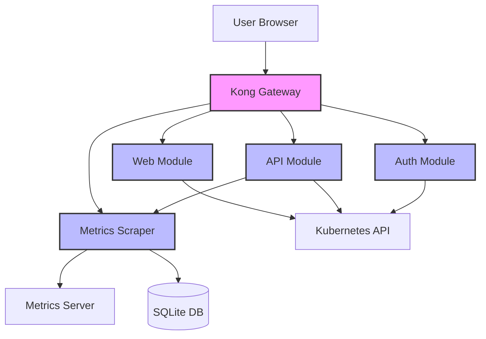
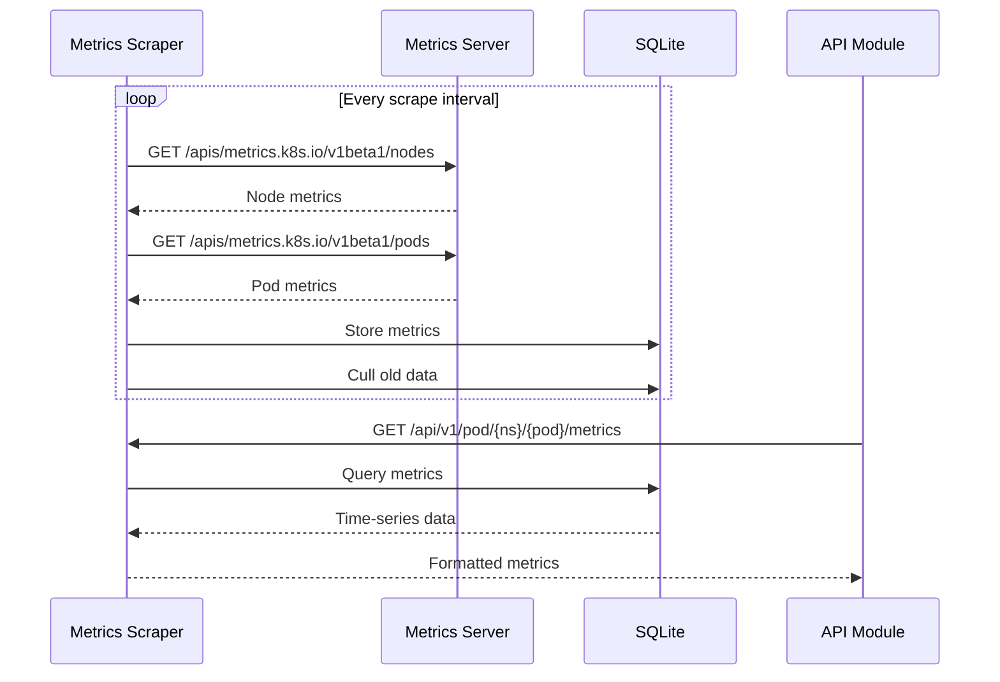

## Introduction

Kubernetes Dashboard is a multi-module web-based UI for managing Kubernetes clusters. The architecture consists of independent, containerized modules that communicate through a Kong API Gateway, providing a scalable and maintainable solution.

## Architecture Diagram



## Core Modules

<CardGroup cols={2}>
  <Card title="API Module" icon="server" href="/architecture/api-module">
    Stateless Go module providing Kubernetes API extensions with aggregation, sorting, filtering, and pagination
  </Card>
  
  <Card title="Auth Module" icon="lock" href="/architecture/auth-module">
    Authentication module handling secure access to the Kubernetes API
  </Card>
  
  <Card title="Web Module" icon="browser" href="/architecture/web-module">
    Angular-based frontend with Go server for configuration and settings management
  </Card>
  
  <Card title="Metrics Scraper" icon="chart-line" href="/architecture/metrics-scraper">
    Background service that scrapes and stores metrics from Kubernetes Metrics Server
  </Card>
</CardGroup>

## Key Design Principles

### Modular Architecture

Each module is independently versioned and deployed as a separate container:

- **API Module**: Extends Kubernetes API functionality
- **Auth Module**: Handles authentication workflows
- **Web Module**: Serves the UI and web-specific logic
- **Metrics Scraper**: Provides time-series metrics data

### Stateless Design

The API and Auth modules are designed to be stateless, enabling:

- Horizontal scaling
- Easy rolling updates
- High availability

<Info>
Only the Metrics Scraper maintains state in a local SQLite database for a small time window of metrics.
</Info>

### API Gateway Pattern

Kubernetes Dashboard v7.0+ uses Kong Gateway as a single entry point:

- **DBless mode**: Configuration-driven, no external database required
- **Request routing**: Routes requests to appropriate backend modules
- **TLS termination**: Handles HTTPS connections
- **Authentication flow**: Coordinates with Auth module

## Communication Patterns

### User Request Flow

1. **User** sends HTTPS request to Kong Gateway
2. **Kong** routes authentication requests to Auth module
3. **Kong** routes API requests to API module based on path (`/api/v1/*`)
4. **Kong** routes web assets and configuration to Web module
5. Backend modules communicate with **Kubernetes API Server**
6. API module fetches metrics from **Metrics Scraper** when needed

### Metrics Collection Flow



## Technology Stack

### Backend

- **Language**: Go (version specified in `modules/go.work`)
- **API Framework**: 
  - go-restful (API module)
  - Gin (Auth & Web modules)
- **Kubernetes Client**: client-go
- **Metrics Storage**: SQLite (modernc.org/sqlite)

### Frontend

- **Framework**: Angular 16.x
- **UI Components**: Angular Material 14.x
- **Charts**: ngx-charts, D3.js
- **Terminal**: xterm.js
- **Build Tool**: Angular CLI

### Infrastructure

- **API Gateway**: Kong (DBless mode)
- **Container Runtime**: Docker
- **Deployment**: Helm Charts
- **Development**: Docker Compose, Kind

## Module Versioning

<Note>
Starting with Dashboard v7.0.0, each module is versioned independently using semantic versioning.
</Note>

Module releases follow the pattern:

- `api/v1.0.0` - API module release
- `auth/v1.0.0` - Auth module release  
- `web/v2.4.5` - Web module release
- `metrics-scraper/v1.0.0` - Metrics Scraper release

The Helm chart version serves as the overall application version and specifies which module versions to deploy together.

## Deployment Architecture

### Helm-Based Deployment

As of v7.0.0, Kubernetes Dashboard only supports Helm-based installation:

```yaml
app:
  mode: 'dashboard'  # or 'api' for API-only deployment
```

**Dashboard Mode**: Deploys all containers (API, Auth, Web, Metrics Scraper, Kong)
**API Mode**: Deploys only the API container and Kong

### Container Communication

All containers communicate through Kubernetes Services:

- `kubernetes-dashboard-kong-proxy` - Kong Gateway (external access)
- `kubernetes-dashboard-api` - API module (internal)
- `kubernetes-dashboard-auth` - Auth module (internal)
- `kubernetes-dashboard-web` - Web module (internal)
- `kubernetes-dashboard-metrics-scraper` - Metrics Scraper (internal)

## Security Architecture

### Authentication

The Auth module supports multiple authentication methods:

- **Token-based**: Kubernetes service account tokens
- **Kubeconfig**: User credentials from kubeconfig file

### Authorization

All Kubernetes API calls use the authenticated user's credentials:

- No privilege escalation
- RBAC enforced by Kubernetes API Server
- Dashboard respects user permissions

### CSRF Protection

CSRF tokens are generated and validated:

- Tokens generated via `/api/v1/csrftoken/{action}` endpoint
- Required for state-changing operations
- Shared secret between API and Auth modules

## Development Environment

Reference: `DEVELOPMENT.md` in source repository

### Local Development

```bash
# Start all modules with Docker Compose
make serve

# Build production images
make image

# Full helm test in Kind cluster
make helm
```

### Module Structure

```
modules/
├── api/              # API module
├── auth/             # Auth module  
├── web/              # Web module
├── metrics-scraper/  # Metrics Scraper
├── common/           # Shared Go packages
└── go.work          # Go workspace configuration
```

## Performance Considerations

### API Module Optimizations

- **Aggregation**: Combines related data (metrics, events) in single responses
- **Pagination**: Limits response size with `itemsPerPage` parameter
- **Filtering**: Server-side filtering reduces data transfer
- **Sorting**: Server-side sorting for efficient client rendering

### Metrics Scraper Optimizations

- **Time Window**: Stores only recent metrics (configurable duration)
- **Auto-culling**: Removes old data automatically
- **Namespace Filtering**: Scrapes only specified namespaces

## Next Steps

<CardGroup cols={2}>
  <Card title="API Module Details" icon="code" href="/architecture/api-module">
    Explore the API module implementation
  </Card>
  
  <Card title="Auth Module Details" icon="shield" href="/architecture/auth-module">
    Learn about authentication mechanisms
  </Card>
  
  <Card title="Web Module Details" icon="palette" href="/architecture/web-module">
    Understand the frontend architecture
  </Card>
  
  <Card title="Metrics Scraper Details" icon="database" href="/architecture/metrics-scraper">
    Deep dive into metrics collection
  </Card>
</CardGroup>
