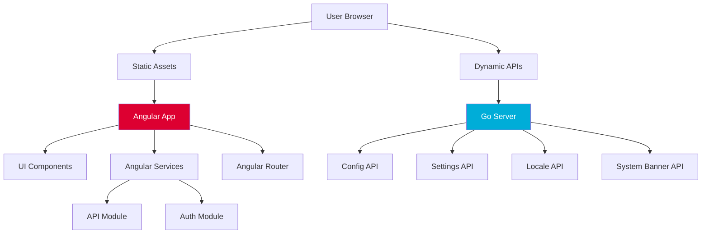

## Overview

The Web module is a hybrid application combining an Angular-based frontend with a Go backend server. It serves the Dashboard UI and handles web-specific logic including settings management, localization, and configuration.

<Info>
The Web module is responsible for presenting data fetched from the Kubernetes API through the API module in an intuitive, user-friendly interface.
</Info>

## Module Architecture

### Dual-Layer Design



### Entry Point

The Go server starts in `modules/web/main.go`:

```go
func main() {
    klog.InfoS("Starting Kubernetes Dashboard Web", "version", environment.Version)
    
    client.Init(
        client.WithUserAgent(environment.UserAgent()),
        client.WithKubeconfig(args.KubeconfigPath()),
    )
    
    certCreator := ecdsa.NewECDSACreator(args.KeyFile(), args.CertFile(), elliptic.P256())
    certManager := certificates.NewCertManager(certCreator, args.DefaultCertDir(), 
                                              args.AutoGenerateCertificates())
    certPath, keyPath, err := certManager.GetCertificatePaths()
    
    if len(certPath) != 0 && len(keyPath) != 0 {
        router.Router().RunTLS(args.Address(), certPath, keyPath)
    } else {
        router.Router().Run(args.InsecureAddress())
    }
}
```

**Reference**: `modules/web/main.go:36-62`

## Frontend Architecture (Angular)

### Technology Stack

```json
{
  "framework": "Angular 16.2",
  "ui": "Angular Material 14.2",
  "charts": "@swimlane/ngx-charts 21.1",
  "terminal": "xterm 5.3",
  "build": "Angular CLI 16.2"
}
```

**Reference**: `modules/web/package.json`

### Project Structure

```
modules/web/src/
├── app/
│   ├── core.module.ts          # Core module with singletons
│   ├── index.module.ts         # Root module
│   ├── index.routing.ts        # Application routes
│   ├── chrome/                 # Shell UI (navbar, sidebar)
│   ├── common/                 # Shared components
│   ├── create/                 # Resource creation views
│   ├── crd/                    # Custom Resource Definition views
│   ├── error/                  # Error pages
│   └── [resources]/            # Resource-specific modules
│       ├── pod/
│       ├── deployment/
│       ├── service/
│       └── ...
├── assets/                     # Static assets
├── environments/               # Environment configs
└── index.html                  # Main HTML file
```

### Core Modules

<Tabs>
  <Tab title="Core Module">
    Provides singleton services shared across the application:
    
    ```typescript
    @NgModule({
      providers: [
        AuthService,
        NamespaceService,
        GlobalSettingsService,
        NotificationService,
        ResourceService,
        VerberService,
      ],
    })
    export class CoreModule {}
    ```
  </Tab>
  
  <Tab title="Chrome Module">
    Shell components:
    
    - Navigation bar
    - Sidebar menu
    - Namespace selector
    - User menu
    - Search bar
  </Tab>
  
  <Tab title="Common Module">
    Reusable components:
    
    - Resource lists
    - Resource cards
    - Charts and graphs
    - Action bars
    - Condition indicators
  </Tab>
</Tabs>

### Key Features

#### Material Design UI

Built with Angular Material components:

```typescript
import { MatButtonModule } from '@angular/material/button';
import { MatCardModule } from '@angular/material/card';
import { MatTableModule } from '@angular/material/table';
import { MatPaginatorModule } from '@angular/material/paginator';
import { MatSortModule } from '@angular/material/sort';
```

Custom themes in `src/_theming.scss`:
- Light theme (`_light.scss`)
- Dark theme (`_dark.scss`)

#### Resource Management

Angular services communicate with API module:

```typescript
// Example: PodService
export class PodService {
  constructor(private http: HttpClient) {}
  
  getPods(namespace: string, query?: DataSelectQuery): Observable<PodList> {
    const params = this.buildQueryParams(query);
    return this.http.get<PodList>(`/api/v1/pod/${namespace}`, { params });
  }
  
  getPodDetail(namespace: string, name: string): Observable<PodDetail> {
    return this.http.get<PodDetail>(`/api/v1/pod/${namespace}/${name}`);
  }
}
```

#### Data Tables

Powered by Angular Material with sorting, filtering, and pagination:

```typescript
<mat-table [dataSource]="dataSource" matSort>
  <ng-container matColumnDef="name">
    <mat-header-cell *matHeaderCellDef mat-sort-header>
      Name
    </mat-header-cell>
    <mat-cell *matCellDef="let pod">
      {{pod.objectMeta.name}}
    </mat-cell>
  </ng-container>
  
  <mat-header-row *matHeaderRowDef="columns"></mat-header-row>
  <mat-row *matRowDef="let row; columns: columns;"></mat-row>
</mat-table>

<mat-paginator [pageSize]="10" [pageSizeOptions]="[10, 25, 50, 100]">
</mat-paginator>
```

#### Metrics Visualization

Charts using ngx-charts and D3:

```typescript
import { NgxChartsModule } from '@swimlane/ngx-charts';

<ngx-charts-line-chart
  [scheme]="colorScheme"
  [results]="metricsData"
  [xAxis]="true"
  [yAxis]="true"
  [legend]="true"
  [showXAxisLabel]="true"
  [showYAxisLabel]="true"
  xAxisLabel="Time"
  yAxisLabel="CPU (cores)">
</ngx-charts-line-chart>
```

#### Terminal Emulation

Integrated terminal using xterm.js:

```typescript
import { Terminal } from 'xterm';
import { FitAddon } from 'xterm-addon-fit';
import * as SockJS from 'sockjs-client';

export class TerminalComponent implements OnInit {
  terminal: Terminal;
  socket: WebSocket;
  
  ngOnInit() {
    this.terminal = new Terminal();
    const fitAddon = new FitAddon();
    this.terminal.loadAddon(fitAddon);
    
    this.terminal.open(this.terminalElement.nativeElement);
    fitAddon.fit();
    
    // Connect to shell endpoint
    this.connectToShell(namespace, pod, container);
  }
  
  connectToShell(namespace: string, pod: string, container: string) {
    const url = `/api/sockjs/?${sessionId}`;
    this.socket = new SockJS(url);
    
    this.socket.onmessage = (event) => {
      this.terminal.write(event.data);
    };
    
    this.terminal.onData((data) => {
      this.socket.send(data);
    });
  }
}
```

### Internationalization (i18n)

Multi-language support using Angular i18n:

```typescript
// Extract translatable strings
<h1 i18n="@@podDetailTitle">Pod Details</h1>

// Translation files in i18n/
├── en/
│   └── messages.xlf
├── de/
│   └── messages.xlf
├── fr/
│   └── messages.xlf
├── ja/
│   └── messages.xlf
└── zh/
    └── messages.xlf
```

Build commands:
```bash
# Extract i18n strings
yarn fix:i18n

# Build with specific locale
ng build --localize
```

**Reference**: `modules/web/i18n/`

## Backend Server (Go)

### Package Structure

```
modules/web/pkg/
├── args/              # Command-line arguments
├── environment/       # Version information
├── router/            # Gin router setup
├── config/            # Configuration API
├── locale/            # Localization API
├── settings/          # Settings management
└── systembanner/      # System banner API
```

### API Endpoints

The Go server provides several web-specific APIs:

#### GET /config

Returns application configuration:

```json
{
  "serverTime": 1234567890,
  "version": "v2.7.0",
  "authenticationMode": "token"
}
```

**Reference**: `modules/web/pkg/config/`

#### GET /api/v1/settings/global

Returns global settings:

```json
{
  "clusterName": "production",
  "itemsPerPage": 25,
  "labelsLimit": 3,
  "logsAutoRefreshTimeInterval": 5,
  "resourceAutoRefreshTimeInterval": 10,
  "disableAccessDeniedNotifications": false,
  "defaultNamespace": "default",
  "namespaceFallbackList": ["default", "kube-system"]
}
```

**Reference**: `modules/web/pkg/settings/`

#### GET /api/v1/systembanner

Returns system banner configuration:

```json
{
  "message": "Scheduled maintenance on Saturday",
  "severity": "WARNING"
}
```

**Reference**: `modules/web/pkg/systembanner/`

#### GET /api/v1/locale

Returns available locales:

```json
{
  "locales": [
    {"id": "en", "name": "English"},
    {"id": "de", "name": "Deutsch"},
    {"id": "fr", "name": "Français"},
    {"id": "ja", "name": "日本語"},
    {"id": "zh", "name": "中文"}
  ]
}
```

**Reference**: `modules/web/pkg/locale/`

### Route Registration

Routes are registered via init() functions:

```go
// modules/web/main.go
import (
    _ "k8s.io/dashboard/web/pkg/config"
    _ "k8s.io/dashboard/web/pkg/locale"
    _ "k8s.io/dashboard/web/pkg/settings"
    _ "k8s.io/dashboard/web/pkg/systembanner"
)
```

**Reference**: `modules/web/main.go:29-33`

## Build Process

### Development Build

```bash
cd modules/web

# Install dependencies
yarn install

# Start development server
yarn start  # or make serve

# Runs on http://localhost:8080
```

Development server features:
- Hot module replacement
- Proxy to API module
- Source maps for debugging

### Production Build

```bash
# Build optimized Angular app
yarn build:prod  # or make build

# Output to dist/
# - Minified JavaScript
# - AOT compilation
# - Tree-shaking
# - CSS optimization
```

**Reference**: `modules/web/package.json:16-18`

### Docker Build

Multi-stage Dockerfile:

```dockerfile
# Stage 1: Build Angular app
FROM node:18 AS web-builder
WORKDIR /workspace
COPY package.json yarn.lock ./
RUN yarn install --frozen-lockfile
COPY . .
RUN yarn build:prod

# Stage 2: Build Go server
FROM golang:1.21 AS go-builder
WORKDIR /workspace
COPY go.mod go.sum ./
RUN go mod download
COPY . .
RUN CGO_ENABLED=0 go build -o server .

# Stage 3: Final image
FROM gcr.io/distroless/static:nonroot
COPY --from=web-builder /workspace/dist /public
COPY --from=go-builder /workspace/server /server
EXPOSE 8000
CMD ["/server"]
```

**Reference**: `modules/web/Dockerfile`

## Configuration

### Angular Configuration

`angular.json` defines build configurations:

```json
{
  "projects": {
    "kubernetes-dashboard": {
      "architect": {
        "build": {
          "options": {
            "outputPath": "dist",
            "index": "src/index.html",
            "main": "src/index.module.ts",
            "localize": true
          },
          "configurations": {
            "production": {
              "optimization": true,
              "sourceMap": false,
              "buildOptimizer": true
            }
          }
        }
      }
    }
  }
}
```

**Reference**: `modules/web/angular.json`

### Proxy Configuration

Development proxy to API module:

```json
{
  "/api/*": {
    "target": "http://localhost:9090",
    "secure": false,
    "logLevel": "debug"
  }
}
```

**Reference**: `modules/web/proxy.conf.json`

## Styling and Theming

### SCSS Architecture

```
src/
├── _variables.scss      # Global variables
├── _mixins.scss         # Reusable mixins
├── _theming.scss        # Theme definitions
├── _light.scss          # Light theme colors
├── _dark.scss           # Dark theme colors
└── index.scss           # Main stylesheet
```

### Custom Material Theme

```scss
@use '@angular/material' as mat;

$primary: mat.define-palette(mat.$indigo-palette);
$accent: mat.define-palette(mat.$pink-palette);
$warn: mat.define-palette(mat.$red-palette);

$theme: mat.define-light-theme((
  color: (
    primary: $primary,
    accent: $accent,
    warn: $warn,
  )
));

@include mat.all-component-themes($theme);
```

## Testing

### Unit Tests (Jest)

```bash
# Run tests
yarn test

# Run with coverage
yarn coverage
```

Test configuration in `jest.config.js`.

### E2E Tests (Cypress)

```bash
# Run Cypress tests
yarn e2e

# Run in headed mode
yarn e2e:headed
```

Cypress configuration in `cypress.config.ts`.

**Reference**: 
- `modules/web/jest.config.js`
- `modules/web/cypress.config.ts`

## Code Quality

### Linting

```bash
# Check TypeScript
yarn check:ts

# Check HTML
yarn check:html

# Check SCSS
yarn check:scss

# Fix all
yarn fix
```

Tools:
- **ESLint**: TypeScript linting
- **Prettier**: Code formatting
- **Stylelint**: SCSS linting

**Reference**: `modules/web/package.json:19-28`

### Code Conventions

Follows:
- [Angular Style Guide](https://angular.io/guide/styleguide)
- [Material Design Guidelines](https://material.io/guidelines/)

**Reference**: `DEVELOPMENT.md:20`

## Deployment

Helm chart configuration:

```yaml
web:
  image:
    repository: kubernetesui/dashboard-web
    tag: v2.7.0
  scaling:
    replicas: 1
  containers:
    args: []
  service:
    type: ClusterIP
    port: 8000
```

**Reference**: `charts/kubernetes-dashboard/templates/deployments/web.yaml`

## Performance Optimizations

<AccordionGroup>
  <Accordion title="Lazy Loading">
    Resource modules are lazy-loaded to reduce initial bundle size:
    
    ```typescript
    const routes: Routes = [
      {
        path: 'pod',
        loadChildren: () => import('./pod/module').then(m => m.PodModule)
      }
    ];
    ```
  </Accordion>
  
  <Accordion title="AOT Compilation">
    Ahead-of-Time compilation for production:
    - Faster rendering
    - Smaller bundle size
    - Early error detection
  </Accordion>
  
  <Accordion title="Change Detection">
    OnPush strategy for better performance:
    
    ```typescript
    @Component({
      changeDetection: ChangeDetectionStrategy.OnPush
    })
    ```
  </Accordion>
  
  <Accordion title="Virtual Scrolling">
    For large lists:
    
    ```html
    <cdk-virtual-scroll-viewport itemSize="50">
      <div *cdkVirtualFor="let item of items">{{item}}</div>
    </cdk-virtual-scroll-viewport>
    ```
  </Accordion>
</AccordionGroup>

## Related Resources

<CardGroup cols={2}>
  <Card title="API Module" icon="server" href="/architecture/api-module">
    Backend API consumed by web module
  </Card>
  
  <Card title="Auth Module" icon="lock" href="/architecture/auth-module">
    Authentication flow integration
  </Card>
  
  <Card title="Angular Documentation" icon="link" href="https://angular.io/docs">
    Official Angular documentation
  </Card>
  
  <Card title="Material Design" icon="palette" href="https://material.angular.io/">
    Angular Material components
  </Card>
</CardGroup>
