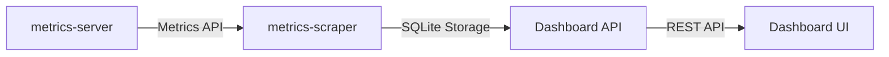

Kubernetes Dashboard supports integration with third-party tools and services to enhance monitoring, logging, and observability capabilities. This guide covers available integrations and how to configure them.

## Overview

Dashboard provides an integration framework that allows it to work seamlessly with external tools and services:

- **Metrics Providers**: CPU and memory metrics from various sources
- **Logging Systems**: Log aggregation and analysis platforms
- **Service Meshes**: Integration with Istio, Linkerd, and others
- **Monitoring Tools**: Prometheus, Grafana, and observability platforms

<Info>
The integration framework is located in `modules/api/pkg/integration/manager.go` and supports pluggable integrations for metrics and other services.
</Info>

## Metrics Integration

Dashboard integrates with metrics providers to display resource utilization data.

### metrics-server (Default)

Dashboard uses **metrics-server** as the default metrics provider:

<Steps>
  <Step title="Install metrics-server">
    Deploy metrics-server to your cluster:
    
    ```bash
    kubectl apply -f https://github.com/kubernetes-sigs/metrics-server/releases/latest/download/components.yaml
    ```
  </Step>
  
  <Step title="Verify Installation">
    Check that metrics-server is running:
    
    ```bash
    kubectl get deployment metrics-server -n kube-system
    kubectl top nodes
    kubectl top pods -A
    ```
  </Step>
  
  <Step title="Deploy metrics-scraper">
    The dashboard-metrics-scraper is deployed automatically with Dashboard:
    
    ```bash
    kubectl get pods -n kubernetes-dashboard | grep metrics-scraper
    ```
  </Step>
</Steps>

### How It Works

The metrics integration flow:



1. **metrics-server** collects metrics from kubelets
2. **dashboard-metrics-scraper** queries the Metrics API every 60 seconds
3. Metrics are stored in a SQLite database
4. Dashboard API serves metrics to the frontend
5. UI displays graphs, sparklines, and usage data

### Configuration

Configure metrics integration via Dashboard flags:

```yaml
args:
- --metrics-scraper-service-name=kubernetes-dashboard-metrics-scraper
- --namespace=kubernetes-dashboard
- --metric-client-check-period=30s
```

**Flags:**
- `--metrics-scraper-service-name`: Service name for the metrics scraper
- `--namespace`: Namespace where scraper is deployed
- `--metric-client-check-period`: Health check interval (default: 30s)

<Info>
Dashboard automatically disables metrics if the provider becomes unavailable, ensuring resilience to metric provider crashes.
</Info>

## Monitoring Integrations

### Prometheus

Integrate Dashboard with Prometheus for advanced monitoring:

#### Scraping Dashboard Metrics

Configure Prometheus to scrape Dashboard metrics:

```yaml
scrape_configs:
- job_name: 'kubernetes-dashboard'
  kubernetes_sd_configs:
  - role: pod
    namespaces:
      names:
      - kubernetes-dashboard
  relabel_configs:
  - source_labels: [__meta_kubernetes_pod_label_k8s_app]
    regex: kubernetes-dashboard
    action: keep
  - source_labels: [__meta_kubernetes_pod_annotation_prometheus_io_scrape]
    regex: "true"
    action: keep
```

#### Adding Prometheus Annotations

Annotate Dashboard resources for Prometheus discovery:

```yaml
metadata:
  annotations:
    prometheus.io/scrape: "true"
    prometheus.io/port: "9090"
    prometheus.io/path: "/metrics"
```

### Grafana

Visualize Dashboard metrics in Grafana:

<Steps>
  <Step title="Add Prometheus Data Source">
    Configure Grafana to use your Prometheus instance:
    
    ```yaml
    apiVersion: 1
    datasources:
    - name: Prometheus
      type: prometheus
      url: http://prometheus:9090
      access: proxy
    ```
  </Step>
  
  <Step title="Import Dashboard">
    Create a Grafana dashboard for Kubernetes Dashboard metrics
  </Step>
  
  <Step title="Configure Panels">
    Add panels for:
    - API request rates
    - Response times
    - Error rates
    - Resource utilization
  </Step>
</Steps>

<Tip>
Use Grafana's Kubernetes dashboards as templates and extend them with Dashboard-specific metrics.
</Tip>

## Logging Integrations

### ELK Stack (Elasticsearch, Logstash, Kibana)

Integrate Dashboard with ELK for advanced log analysis:

#### Fluentd Configuration

Deploy Fluentd to collect Dashboard logs:

```yaml
apiVersion: v1
kind: ConfigMap
metadata:
  name: fluentd-config
data:
  fluent.conf: |
    <source>
      @type tail
      path /var/log/containers/kubernetes-dashboard-*.log
      pos_file /var/log/dashboard.log.pos
      tag kubernetes.dashboard
      format json
    </source>
    
    <match kubernetes.dashboard>
      @type elasticsearch
      host elasticsearch
      port 9200
      logstash_format true
      logstash_prefix dashboard
    </match>
```

#### Kibana Dashboards

Create Kibana visualizations for:
- Error rate trends
- Request volume by endpoint
- Authentication failures
- Resource access patterns

### Grafana Loki

Use Loki for lightweight log aggregation:

```yaml
apiVersion: v1
kind: ConfigMap
metadata:
  name: promtail-config
data:
  promtail.yaml: |
    server:
      http_listen_port: 9080
    clients:
    - url: http://loki:3100/loki/api/v1/push
    scrape_configs:
    - job_name: kubernetes-dashboard
      kubernetes_sd_configs:
      - role: pod
        namespaces:
          names:
          - kubernetes-dashboard
      relabel_configs:
      - source_labels: [__meta_kubernetes_pod_label_k8s_app]
        target_label: app
      - source_labels: [__meta_kubernetes_namespace]
        target_label: namespace
```

## Service Mesh Integration

### Istio

Integrate Dashboard with Istio service mesh:

#### Enable Sidecar Injection

```yaml
apiVersion: v1
kind: Namespace
metadata:
  name: kubernetes-dashboard
  labels:
    istio-injection: enabled
```

Or annotate specific pods:

```yaml
metadata:
  annotations:
    sidecar.istio.io/inject: "true"
```

#### Virtual Service Configuration

Route traffic through Istio:

```yaml
apiVersion: networking.istio.io/v1beta1
kind: VirtualService
metadata:
  name: dashboard
  namespace: kubernetes-dashboard
spec:
  hosts:
  - dashboard.example.com
  gateways:
  - dashboard-gateway
  http:
  - route:
    - destination:
        host: kubernetes-dashboard
        port:
          number: 443
```

#### Observability

Istio provides automatic metrics, traces, and logs for Dashboard:

- **Kiali**: Service graph and topology
- **Jaeger**: Distributed tracing
- **Grafana**: Istio dashboards

### Linkerd

Integrate with Linkerd service mesh:

```bash
# Inject Linkerd proxy
kubectl get deploy -n kubernetes-dashboard -o yaml | linkerd inject - | kubectl apply -f -

# Verify injection
linkerd -n kubernetes-dashboard check --proxy
```

## Authentication Integration

### OIDC (OpenID Connect)

Dashboard supports OIDC authentication through the Kubernetes API server.

#### Configure API Server

Enable OIDC on your cluster:

```yaml
kind: ClusterConfiguration
apiVersion: kubeadm.k8s.io/v1beta3
apiServer:
  extraArgs:
    oidc-issuer-url: https://accounts.google.com
    oidc-client-id: kubernetes
    oidc-username-claim: email
    oidc-groups-claim: groups
```

#### Login Flow

<Steps>
  <Step title="Obtain OIDC Token">
    User authenticates with identity provider
  </Step>
  
  <Step title="Present Token to Dashboard">
    Paste the ID token in Dashboard login screen
  </Step>
  
  <Step title="API Server Validation">
    Kubernetes API server validates the token
  </Step>
  
  <Step title="Access Granted">
    Dashboard proxies requests with the authenticated identity
  </Step>
</Steps>

### OAuth2 Proxy

Use oauth2-proxy for SSO integration:

```yaml
apiVersion: apps/v1
kind: Deployment
metadata:
  name: oauth2-proxy
spec:
  template:
    spec:
      containers:
      - name: oauth2-proxy
        image: quay.io/oauth2-proxy/oauth2-proxy:latest
        args:
        - --provider=oidc
        - --email-domain=*
        - --upstream=http://kubernetes-dashboard:443
        - --http-address=0.0.0.0:4180
        - --redirect-url=https://dashboard.example.com/oauth2/callback
        env:
        - name: OAUTH2_PROXY_CLIENT_ID
          value: your-client-id
        - name: OAUTH2_PROXY_CLIENT_SECRET
          valueFrom:
            secretKeyRef:
              name: oauth2-proxy
              key: client-secret
```

## Alert Manager Integration

Integrate with Prometheus AlertManager:

### Alert Rules

Define alerts for Dashboard issues:

```yaml
groups:
- name: dashboard
  interval: 30s
  rules:
  - alert: DashboardDown
    expr: up{job="kubernetes-dashboard"} == 0
    for: 5m
    labels:
      severity: critical
    annotations:
      summary: "Kubernetes Dashboard is down"
      description: "Dashboard has been down for more than 5 minutes"
  
  - alert: DashboardHighErrorRate
    expr: rate(dashboard_errors_total[5m]) > 0.05
    for: 10m
    labels:
      severity: warning
    annotations:
      summary: "High error rate in Dashboard"
      description: "Error rate is {{ $value }} errors/sec"
```

### Notification Routing

Configure alert routing:

```yaml
route:
  group_by: ['alertname', 'cluster']
  group_wait: 10s
  group_interval: 10s
  repeat_interval: 12h
  receiver: 'team-dashboard'
  routes:
  - match:
      severity: critical
    receiver: 'pagerduty'

receivers:
- name: 'team-dashboard'
  slack_configs:
  - channel: '#kubernetes-dashboard'
    text: '{{ range .Alerts }}{{ .Annotations.description }}{{ end }}'

- name: 'pagerduty'
  pagerduty_configs:
  - service_key: your-pagerduty-key
```

## Custom Integrations

### Integration Framework

Dashboard's integration framework supports custom providers:

```go
type IntegrationManager interface {
    // Metric returns metric integration
    Metric() MetricIntegration
    // RegisterMetricIntegration registers new metric integration
    RegisterMetricIntegration(integration MetricIntegration)
}
```

### Creating a Custom Integration

Implement custom metric providers or integrations by extending the framework.

<Info>
Future versions of Dashboard may support additional integration types beyond metrics, such as custom logging providers or workflow integrations.
</Info>

## Best Practices

<AccordionGroup>
  <Accordion title="Use dedicated namespaces for integrations">
    Deploy monitoring and logging tools in separate namespaces:
    
    ```bash
    kubectl create namespace monitoring
    kubectl create namespace logging
    ```
  </Accordion>
  
  <Accordion title="Implement resource limits">
    Set resource requests/limits for integration components:
    
    ```yaml
    resources:
      requests:
        memory: "256Mi"
        cpu: "100m"
      limits:
        memory: "512Mi"
        cpu: "200m"
    ```
  </Accordion>
  
  <Accordion title="Enable TLS for metrics endpoints">
    Secure metrics scraping with TLS:
    
    ```yaml
    scheme: https
    tls_config:
      ca_file: /etc/prometheus/ca.crt
    ```
  </Accordion>
  
  <Accordion title="Configure retention policies">
    Set appropriate retention for logs and metrics:
    
    ```yaml
    # Prometheus
    --storage.tsdb.retention.time=30d
    
    # Elasticsearch
    indices.lifecycle.policy
    ```
  </Accordion>
  
  <Accordion title="Monitor integration health">
    Set up alerts for integration failures:
    
    ```yaml
    - alert: MetricsScraperDown
      expr: up{job="dashboard-metrics-scraper"} == 0
    ```
  </Accordion>
</AccordionGroup>

## Troubleshooting

<AccordionGroup>
  <Accordion title="Metrics not appearing">
    **Check metrics-server:**
    ```bash
    kubectl get pods -n kube-system | grep metrics-server
    kubectl logs -n kube-system deployment/metrics-server
    ```
    
    **Verify metrics-scraper:**
    ```bash
    kubectl logs -n kubernetes-dashboard deployment/dashboard-metrics-scraper
    ```
    
    **Test Metrics API:**
    ```bash
    kubectl top nodes
    kubectl top pods -A
    ```
  </Accordion>
  
  <Accordion title="Prometheus not scraping">
    **Check service discovery:**
    ```bash
    kubectl get servicemonitor -n kubernetes-dashboard
    ```
    
    **Verify annotations:**
    ```bash
    kubectl get pods -n kubernetes-dashboard -o yaml | grep prometheus.io
    ```
    
    **Check Prometheus targets:**
    Navigate to Prometheus UI → Status → Targets
  </Accordion>
  
  <Accordion title="Istio sidecar not injecting">
    **Verify namespace label:**
    ```bash
    kubectl get namespace kubernetes-dashboard --show-labels
    ```
    
    **Check injection status:**
    ```bash
    kubectl get pods -n kubernetes-dashboard -o jsonpath='{range .items[*]}{.metadata.name}{"\t"}{.spec.containers[*].name}{"\n"}{end}'
    ```
    
    Look for `istio-proxy` container.
  </Accordion>
</AccordionGroup>

## Next Steps

<CardGroup cols={2}>
  <Card title="Monitoring Metrics" href="/user/monitoring-metrics">
    Learn about metrics collection and visualization
  </Card>
  <Card title="Viewing Logs" href="/user/viewing-logs">
    Access and analyze container logs
  </Card>
</CardGroup>