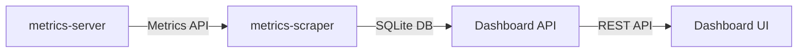

Kubernetes Dashboard integrates with metrics-server to provide real-time insights into cluster resource utilization. This guide covers how to view and interpret metrics for nodes, pods, and other resources.

## Overview

Dashboard uses the **dashboard-metrics-scraper** sidecar to collect and store metrics data, providing:

- CPU and memory usage graphs
- Historical sparklines in list views
- Resource utilization trends
- Per-pod and per-node metrics

<Info>
Metrics collection requires [metrics-server](https://github.com/kubernetes-sigs/metrics-server) to be running in your cluster. The metrics-scraper is deployed by default with Kubernetes Dashboard.
</Info>

## Prerequisites

### Installing metrics-server

Verify metrics-server is running:

```bash
kubectl top nodes
```

If the command fails, install metrics-server:

```bash
kubectl apply -f https://github.com/kubernetes-sigs/metrics-server/releases/latest/download/components.yaml
```

Verify installation:

```bash
kubectl get deployment metrics-server -n kube-system
kubectl top pod
```

### Dashboard Metrics Scraper

The metrics scraper is automatically deployed with Dashboard. It:

- Queries the Metrics API every 60 seconds
- Stores data points in a SQLite database
- Serves metrics to the Dashboard frontend
- Maintains historical data for sparklines and graphs

## Metrics Architecture

The metrics flow:



### Metrics Data Structure

The scraper stores metrics in a structured format (`modules/metrics-scraper/pkg/api/dashboard/types.go:28-75`):

```go
type SidecarMetric struct {
    DataPoints   []DataPoint
    MetricPoints []MetricPoint
    MetricName   string
    UIDs         []types.UID
}

type MetricPoint struct {
    Timestamp time.Time
    Value     uint64
}

type DataPoint struct {
    X int64  // Timestamp
    Y int64  // Value
}
```

### Database Schema

Metrics are stored in two tables:

**Pods Table:**
```sql
CREATE TABLE pods (
    namespace TEXT,
    name TEXT,
    uid TEXT,
    time TEXT,
    cpu INTEGER,
    memory INTEGER
)
```

**Nodes Table:**
```sql
CREATE TABLE nodes (
    name TEXT,
    uid TEXT,
    time TEXT,
    cpu INTEGER,
    memory INTEGER
)
```

## Viewing Node Metrics

Access node metrics at **Cluster** → **Nodes**.

### Node Metrics Display

<CardGroup cols={2}>
  <Card title="CPU Usage" icon="microchip">
    Shows CPU utilization in millicores and percentage
  </Card>
  <Card title="Memory Usage" icon="memory">
    Displays memory consumption in bytes and percentage
  </Card>
  <Card title="Pod Count" icon="cubes">
    Number of pods running on the node
  </Card>
  <Card title="Allocation" icon="chart-pie">
    Resource requests vs. capacity
  </Card>
</CardGroup>

### Node Detail Metrics

Click on a node to view detailed metrics:

- **CPU Chart**: Historical CPU usage over time
- **Memory Chart**: Historical memory consumption
- **Resource Allocation**: Visual breakdown of allocated resources
- **Capacity**: Total node capacity vs. requests vs. limits

<Tip>
Hover over chart data points to see exact values and timestamps.
</Tip>

## Viewing Pod Metrics

Access pod metrics at **Workloads** → **Pods**.

### List View Sparklines

The pod list displays mini sparkline graphs showing:

- Recent CPU usage trend
- Recent memory usage trend
- Visual indication of resource consumption patterns

### Pod Detail Metrics

The pod detail page shows:

```go
type PodMetrics struct {
    CPUUsage    int64  // Current CPU in millicores
    MemoryUsage int64  // Current memory in bytes
    CPUHistory  []DataPoint
    MemoryHistory []DataPoint
}
```

<Tabs>
  <Tab title="CPU Metrics">
    - **Current Usage**: Millicores currently consumed
    - **Requested**: CPU requests defined in pod spec
    - **Limited**: CPU limits defined in pod spec
    - **Usage Graph**: Historical CPU consumption
  </Tab>
  
  <Tab title="Memory Metrics">
    - **Current Usage**: Bytes currently consumed
    - **Requested**: Memory requests in pod spec
    - **Limited**: Memory limits in pod spec  
    - **Usage Graph**: Historical memory consumption
  </Tab>
</Tabs>

## Metrics API Endpoints

The metrics scraper exposes REST endpoints (`modules/metrics-scraper/pkg/api/dashboard/dashboard.go:33-36`):

### Node Metrics

```http
GET /nodes/{nodeName}/metrics/{metricName}/{whatever}
```

Example:
```bash
curl http://dashboard-metrics-scraper/nodes/node-1/metrics/cpu/
```

Response:
```json
{
  "items": [
    {
      "metricName": "cpu",
      "metricPoints": [
        {"timestamp": "2026-03-05T10:30:00Z", "value": 450000000},
        {"timestamp": "2026-03-05T10:31:00Z", "value": 520000000}
      ],
      "dataPoints": [{"x": 1709637000, "y": 450}],
      "uids": ["node-1-uid"]
    }
  ]
}
```

### Pod Metrics

```http
GET /namespaces/{namespace}/pod-list/{podName}/metrics/{metricName}/{whatever}
```

Example:
```bash
curl http://dashboard-metrics-scraper/namespaces/default/pod-list/nginx-abc/metrics/memory/
```

## Deployment Metrics

View aggregated metrics for deployments at **Workloads** → **Deployments**.

The deployment view shows (`modules/api/pkg/resource/deployment/list.go:31-44`):

```go
type DeploymentList struct {
    ListMeta          types.ListMeta
    CumulativeMetrics []metricapi.Metric
    Status            common.ResourceStatus
    Deployments       []Deployment
    Errors            []error
}
```

**Cumulative metrics include:**
- Aggregate CPU usage across all pods
- Aggregate memory usage across all pods
- Per-deployment sparklines
- Resource utilization trends

## Metrics Configuration

Customize metrics behavior with Dashboard flags:

### API Container Flags

```bash
--metrics-scraper-service-name=kubernetes-dashboard-metrics-scraper
--namespace=kubernetes-dashboard
--metric-client-check-period=30s
```

### Metrics Scraper Flags

```bash
--db-file=/tmp/metrics.db
--metric-resolution=1m
--metric-duration=15m
```

<Info>
The `--metric-client-check-period` flag controls health check frequency. Dashboard disables metrics if the scraper becomes unavailable.
</Info>

## Understanding Metrics Data

### CPU Metrics

CPU is measured in millicores:

- **1000m** = 1 full CPU core
- **500m** = 0.5 CPU cores
- **100m** = 10% of one CPU core

### Memory Metrics

Memory is measured in bytes:

- **1024 bytes** = 1 KiB
- **1048576 bytes** = 1 MiB
- **1073741824 bytes** = 1 GiB

### Time Windows

Default retention:

- **Scrape Interval**: 60 seconds
- **Retention Period**: 15 minutes
- **Database Size**: Automatically managed

## Troubleshooting

<AccordionGroup>
  <Accordion title="Metrics not displayed">
    **Check metrics-server installation:**
    ```bash
    kubectl get pods -n kube-system | grep metrics-server
    kubectl top nodes
    ```
    
    **Verify metrics-scraper is running:**
    ```bash
    kubectl get pods -n kubernetes-dashboard | grep metrics-scraper
    kubectl logs -n kubernetes-dashboard deployment/kubernetes-dashboard-metrics-scraper
    ```
  </Accordion>
  
  <Accordion title="Metrics lag or outdated">
    Check the scrape interval and database health:
    ```bash
    kubectl logs -n kubernetes-dashboard deployment/kubernetes-dashboard-metrics-scraper --tail=50
    ```
    
    Restart the metrics scraper:
    ```bash
    kubectl rollout restart deployment/kubernetes-dashboard-metrics-scraper -n kubernetes-dashboard
    ```
  </Accordion>
  
  <Accordion title="High memory usage by scraper">
    Reduce retention period or scrape interval:
    ```bash
    --metric-duration=10m  # Reduce from 15m
    ```
  </Accordion>
</AccordionGroup>

## Metrics Integration

Dashboard integrates with the metrics ecosystem:

### Supported Metrics Providers

<CardGroup cols={2}>
  <Card title="metrics-server" icon="server">
    Default metrics provider using the Metrics API
  </Card>
  <Card title="Custom Providers" icon="plug">
    Extend via the integration framework
  </Card>
</CardGroup>

### Integration Framework

The integration framework (`modules/api/pkg/integration/manager.go`) supports:

- Multiple metric providers
- Health checking and failover
- Provider registration and discovery

<Info>
Dashboard currently integrates metrics-server by default. The integration framework allows for future expansion to providers like Prometheus or custom metrics APIs.
</Info>

## Best Practices

<AccordionGroup>
  <Accordion title="Monitor resource utilization regularly">
    Check metrics weekly to identify resource bottlenecks and optimize allocations.
  </Accordion>
  
  <Accordion title="Set appropriate resource limits">
    Use metrics data to determine realistic CPU and memory limits for your workloads.
  </Accordion>
  
  <Accordion title="Alert on anomalies">
    Integrate external monitoring systems for alerting on unusual metric patterns.
  </Accordion>
  
  <Accordion title="Scale based on metrics">
    Use HorizontalPodAutoscaler (HPA) to automatically scale based on CPU/memory metrics.
  </Accordion>
</AccordionGroup>

## Next Steps

<CardGroup cols={2}>
  <Card title="Viewing Logs" href="/user/viewing-logs">
    Access container logs for debugging
  </Card>
  <Card title="Integrations" href="/user/integrations">
    Learn about third-party monitoring integrations
  </Card>
</CardGroup>